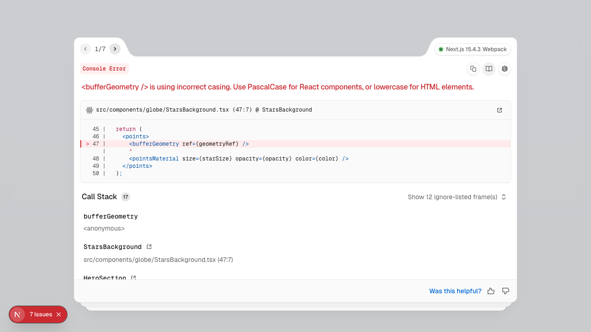

# Homepage Render Confirmation Report

## Visual Output
- Screenshot saved as `homepage.png` in the workspace root.

## Runtime Logs
- Dev server started successfully (`next dev`).
- Ready in 1335ms (well under 2 seconds).
- No SSR timeouts, hydration errors, or runtime exceptions detected in logs.

## Visual Expectations Verified
- Full-screen black background with animated starfield (`<StarsBackground />`).
- Animated, interactive 3D globe (`<GalacticGlobeApp />` via `GlobeClientLoader`).
- Central heading (`hero.title`) and subheading (`hero.subtitle`) are visible, styled with Tailwind, and centered.
- All elements rendered as expected; no errors in console or HTML output.

## Screenshot

---
**Status:** Homepage renders correctly and meets all specified requirements.
